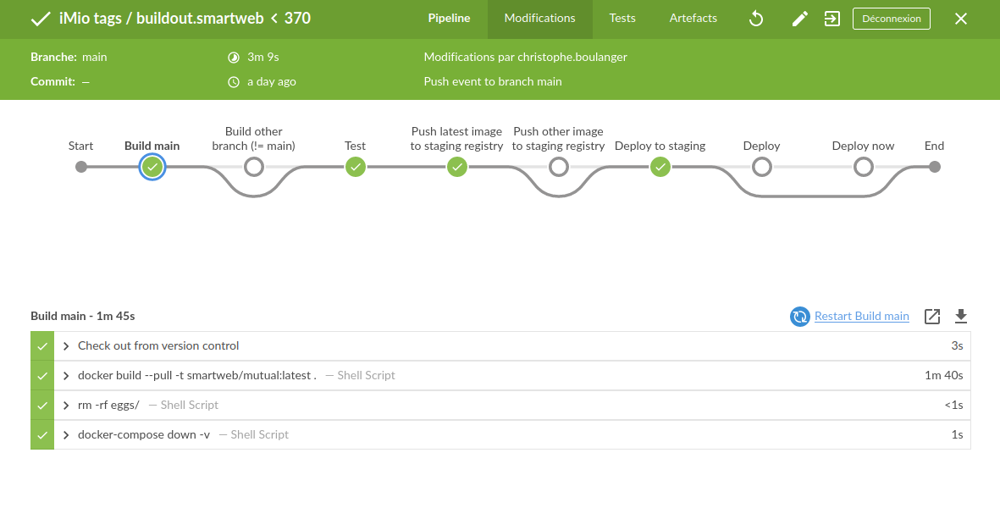
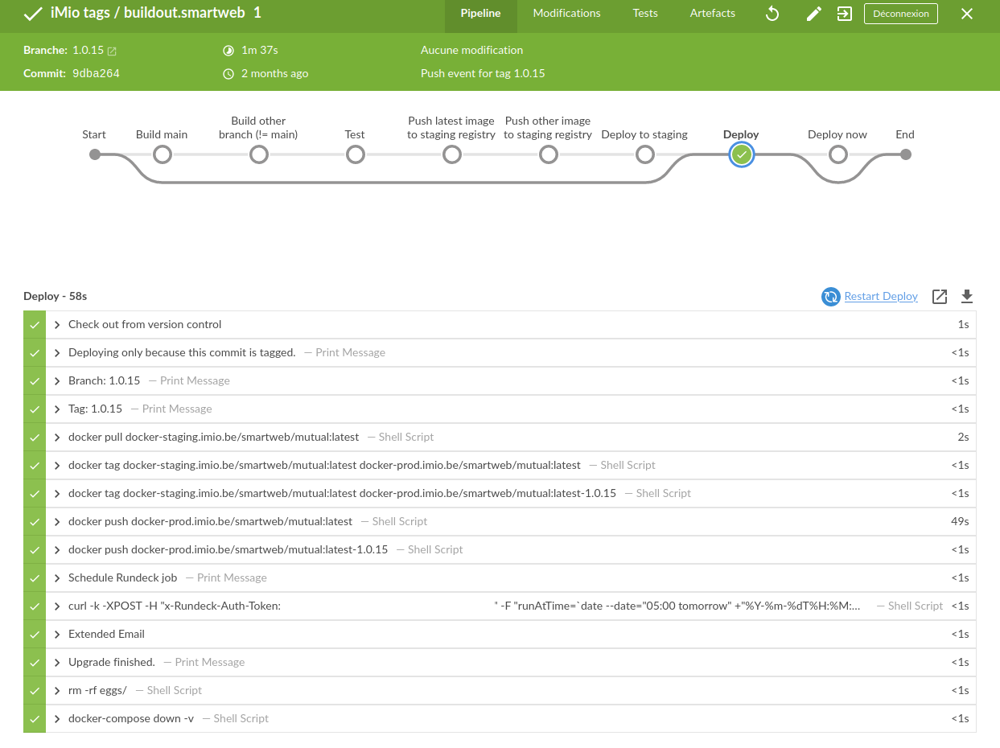

[comment]: # (This presentation was made with markdown-slides)
[comment]: # (This is a CommonMark compliant comment. It will not be included in the presentation.)
[comment]: # (Compile this presentation with the command below)
[comment]: # (mdslides presentation.md --include medias)

[comment]: # (Set the theme:)
[comment]: # (THEME = simple)
[comment]: # (CODE_THEME = base16/zenburn)
[comment]: # (The list of themes is at https://revealjs.com/themes/)
[comment]: # (The list of code themes is at https://highlightjs.org/)

[comment]: # "You can also use quotes instead of parenthesis"
[comment]: # "THEME = simple"

[comment]: # (Pass optional settings to reveal.js:)
[comment]: # (controls: true)
[comment]: # (keyboard: true)
[comment]: # (markdown: { smartypants: true })
[comment]: # (hash: false)
[comment]: # (respondToHashChanges: false)
[comment]: # (Other settings are documented at https://revealjs.com/config/)

<div style="position:relative; top: -6.5em; color: white; font-weight: bold;"> Benoît Suttor | iMio | October 13, 2022 </div>

<div> How we created, deployed and updated over 200 websites at iMio with no downtime </div>

[comment]: # (!!! data-background-image="medias/background-presentation-imio.png" data-background-size="contain")


## About

This presentation is avaiable on github: https://github.com/bsuttor/ploneconf-talk-2022

I use markdown-slides to generated it: https://gitlab.com/da_doomer/markdown-slides

[comment]: # (!!! data-background-image="medias/background-presentation-imio.png" data-background-size="contain")


## Table of contents  <!-- .element: style="color:white; position: relative; top: -2em;" -->

1. **Introduction**
2. Buildout and Docker
3. Environments
4. CI/CD - Jenkins - Rundeck
5. Puppet
6. Demo

[comment]: # (!!! data-background-image="medias/background-presentation-imio.png" data-background-size="contain")


## Introduction

- Creation of 200 websites developped in Plone
- Need process to update it
- Start thinking as DevOps and SRE (Site Reliability Engineering)

<!--
As we created and managed a lot of websites developped in Plone, we have to easily updated of all of them.
So we begin to think as DevOps enterprise and we start to create process to updated it -->


[comment]: # (!!! data-background-image="medias/background-presentation-imio.png" data-background-size="contain")


### What we want to improve
- Avoid human errors
- Remove ssh access to maximum of people
```bash
# rm -rf /
```

[comment]: # (!!! data-background-image="medias/background-presentation-imio.png" data-background-size="contain")


### What we do not want anymore <!-- .element: style="color:white; position: relative; top: -2em;" -->

- Devs who made bugfix directly on production

<iframe width="560" height="315" src="medias/quickfix-prod.webm" title="YouTube video player" frameborder="0" allow="accelerometer;  ; clipboard-write; encrypted-media; gyroscope; picture-in-picture" allowfullscreen></iframe>


[comment]: # (!!! data-auto-animate data-background-image="medias/background-presentation-imio.png" data-background-size="contain")

### We want small and frequent releases <!-- .element: style="color:white; position: relative; top: -3em;" -->

- Fewer changes in the source code
- Changes are still fresh in mind
- If there is a bug, it’s easiest to find it
- Junior dev should make release

[comment]: # (!!! data-background-image="medias/background-presentation-imio.png" data-background-size="contain")

### We want to use same tools than dev for CI

- Buildout are on repository in Github
- We should used it to deploy new changes

-> We decided to use zest.releaser for releasing our buildouts

[comment]: # (!!! data-background-image="medias/background-presentation-imio.png" data-background-size="contain")

## Table of contents <!-- .element: style="color:white; position: relative; top: -2em;" -->

1. Introduction
2. **Buildout and Docker**
3. Environments
4. CI/CD - Jenkins - Rundeck
5. Puppet
6. Demo

[comment]: # (!!! data-background-image="medias/background-presentation-imio.png" data-background-size="contain")


### How we transforms our buildout  <!-- .element: style="color:white; position: relative; top: -3em;" -->

- Add version.txt file
- Add CHANGES.rst file


And it's all, we can now make "fullrelease" of our buildout.

[comment]: # (!!! data-auto-animate data-background-image="medias/background-presentation-imio.png" data-background-size="contain")


### Other avantage <!-- .element: style="color:white;" -->

We have a clear changelog of what is done in a new release

```markdown
    Adapt SolR config to use tika for file indexing
    [mpeeters]

    Move/adapt ban_physicalpath method into imio.smartweb.common
    [boulch, laulaz]

imio.smartweb.common 1.0.6

    Add ban_physicalpath method (taken from policy)
    [boulch, laulaz]

pas.plugins.imio 2.0

    Get userid and user login for user connected by JWT.
    [bsuttor]
```

[comment]: # (!!!  data-auto-animate data-background-image="medias/background-presentation-imio.png" data-background-size="contain")

### Build on a Docker image <!-- .element: style="color:white; position: relative; top: -3em;" -->

- Good way to package our code base
- A new Docker image is created on each commit on buildout repository
- This image is pushed to our own Docker registry
- Build failled if a package is not pinned

[comment]: # (!!! data-background-image="medias/background-presentation-imio.png" data-background-size="contain")

### Test image <!-- .element: style="color:white; position: relative; top: -3.5em;" -->
- With pytest and docker-compose
- Test if "Listening at: http://0.0.0.0:8080" is in logs
- Test with restapi if our "policy" is installed

[comment]: # (!!! data-background-image="medias/background-presentation-imio.png" data-background-size="contain")

### Code example <!-- .element: style="color:white; position: relative; top: -1em;" -->
```python
def test_start_instance(docker_compose):
    project = project_from_options(path.dirname(__file__), options)
    cmd = TopLevelCommand(project)
    instance = [serv for serv in cmd.project.services if serv.name == "instance"][0]
    container_name = f"{instance.project}_{instance.name}_1"
    client = docker.from_env()
    container = client.containers.get(container_name)
    is_plone_ready = False
    timeout = time.time() + 60
    while not is_plone_ready:
        time.sleep(1)
        if container not in client.containers.list():
            print("Instance container is down, it must restart")
            break
        bytes_logs = container.logs()
        logs = bytes_logs.decode(encoding="utf-8", errors="strict")
        if "Listening at: http://0.0.0.0:8080" in logs:
            is_plone_ready = True
            print("Instance started !")
            continue
        if time.time() > timeout:
            print("Timeout")
            break
    assert is_plone_ready
```
[comment]: # (!!! data-background-image="medias/background-presentation-imio.png" data-background-size="contain")
### Code example <!-- .element: style="color:white; position: relative; top: -1em;" -->

```python
def test_policy_installed(docker_compose):
    project = project_from_options(path.dirname(__file__), options)
    cmd = TopLevelCommand(project)
    instance = [serv for serv in cmd.project.services if serv.name == "instance"][0]
    container_name = f"{instance.project}_{instance.name}_1"
    client = docker.from_env()
    container = client.containers.get(container_name)
    while get_health(container) != "healthy":
        time.sleep(1)
    installed_package_id = "imio.smartweb.policy"
    package_info = requests.get(
        f"http://localhost:8080/Plone/@addons/{installed_package_id}",
        headers={"Accept": "application/json"},
        auth=("admin", "admin"),
    ).json()
    assert package_info.get(
        "is_installed"
    ), f"package {installed_package_id} is not installed"
```
[comment]: # (!!!  data-auto-animate data-background-image="medias/background-presentation-imio.png" data-background-size="contain")

## Table of contents <!-- .element: style="color:white; position: relative; top: -2em;" -->

1. Introduction
2. Buildout and Docker
3. **Environments**
4. CI/CD - Jenkins - Rundeck
5. Puppet
6. Demo

[comment]: # (!!! data-background-image="medias/background-presentation-imio.png" data-background-size="contain")


### Environments <!-- .element: style="color:white; position: relative; top: -0em;" -->
#### Devs

Use to local dev with buildout, pip, mr.developer, direnv, pre-commit ...

#### Staging

When change are detected, staging instances should be automaticaly updated

#### Production

Production instances should be updated with a human action

[comment]: # (!!! data-background-image="medias/background-presentation-imio.png" data-background-size="contain")


### Staging

When a new commit is push to your buildout repo
- New docker image is build
- Tested
- Automaticaly deploy

[comment]: # (!!! data-background-image="medias/background-presentation-imio.png" data-background-size="contain")


### Production

When a new tag is created, latest staging Docker image is copied to docker prod registry.

So a human action is required to deploy to production and staging is automatically updated.

[comment]: # (!!! data-background-image="medias/background-presentation-imio.png" data-background-size="contain")
## Table of contents <!-- .element: style="color:white; position: relative; top: -2em;" -->

1. Introduction
2. Buildout and Docker
3. Environments
4. **CI/CD - Jenkins - Rundeck**
5. Puppet
6. Demo

[comment]: # (!!! data-background-image="medias/background-presentation-imio.png" data-background-size="contain")


## How we do that: Jenkins

We used Jenkins to scan all our buildout repo on our organization on Github

We build Jenkins pipeline for our CI/CD

[comment]: # (!!! data-background-image="medias/background-presentation-imio.png" data-background-size="contain")

### Jenkins pipeline <!-- .element: style="color:white;" -->



[comment]: # (!!! data-background-image="medias/background-presentation-imio.png" data-background-size="contain")


### Jenkinsfile <!-- .element: style="color:white; position: relative; top: -1em;" -->
```
stage('Build main') {
    agent any
    when {
        allOf {
            branch "main"
            not {
                changelog '.*\\[(ci)?\\-?\\s?skip\\-?\\s?(ci)?\\].*'
            }
            not {
                changelog '^Back to development:*'
            }
            not {
                changelog '^Preparing release *'
            }
        }
    }
    steps {
        sh "docker build --pull -t imio-plone:latest ."
    }
}
```

[comment]: # (!!! data-background-image="medias/background-presentation-imio.png" data-background-size="contain")


```
stage('Test') {
    agent any
    when {
        allOf{
            not {
                buildingTag()
            }
            not {
                changelog '.*\\[(ci)?\\-?\\s?skip\\-?\\s?(ci)?\\].*'
            }
            not {
                changelog '^Back to development:*'
            }
            not {
                changelog '^Preparing release *'
            }
        }
    }
    steps {
        sh "make test-image"
    }
}
```

[comment]: # (!!! data-background-image="medias/background-presentation-imio.png" data-background-size="contain")


```
stage('Deploy to staging') {
    agent any
    when {
        allOf {
            expression {
                currentBuild.result == 'SUCCESS'  || currentBuild.result == null
            }
            not {
                changelog '.*\\[(ci)?\\-?\\s?skip\\-?\\s?(ci)?\\].*'
            }
            not {
                changelog '^Back to development:*'
            }
            not {
                changelog '^Preparing release *'
            }
        }
    }
    steps {
        sh "curl to-start-rundeck-job-which-restart-staging-instances"
    }
}
```

[comment]: # (!!! data-background-image="medias/background-presentation-imio.png" data-background-size="contain")

### Rundeck

- Avoid ssh access to your server
- Used job defined to make precise actions
- Restart instance one by one

[comment]: # (!!! data-background-image="medias/background-presentation-imio.png" data-background-size="contain")


```
stage('Deploy') {
    agent any
    when {
        buildingTag()
    }
    steps {
        moveImageToProdRegistry(env.TAG_NAME, pipelineParams.imageName)
        sh "curl to-start-rundeck-job-which-restart-production-instances"
        emailext to: "talk2022+jenkins@imio.be",
            recipientProviders: [developers(), requestor()],
            subject: "New release deployed: ${currentBuild.displayName}",
            body: "The pipeline ${env.JOB_NAME} ${env.BUILD_NUMBER} released ${env.fullDisplayName} <br />See <a href='https://github.com/IMIO/buildout.smartweb/blob/main/CHANGES.rst'>Changelog</a><"

    }
}

```

[comment]: # (!!! data-background-image="medias/background-presentation-imio.png" data-background-size="contain")

### Pipeline with a new tag <!-- .element: style="color:white;" -->


[comment]: # (!!! data-background-image="medias/background-presentation-imio.png" data-background-size="contain")

## Table of contents <!-- .element: style="color:white; position: relative; top: -2em;" -->

1. Introduction
2. Buildout and Docker
3. Environments
4. CI/CD - Jenkins - Rundeck
5. **Puppet**
6. Demo

[comment]: # (!!! data-background-image="medias/background-presentation-imio.png" data-background-size="contain")

### Puppet
Puppet used to configure our server, it's a tool to make infrastructure automation
- create systemd files to start container (based on docker-compose)
- create cron for backup, pack, ...
- create Apache aliases

[comment]: # (!!! data-background-image="medias/background-presentation-imio.png" data-background-size="contain")


All this process take a lot of iteration to get there,

but we should now improve all of this by migration to Kubernetes with a Helm chart

[comment]: # (!!! data-background-image="medias/background-presentation-imio.png" data-background-size="contain")


## Table of contents <!-- .element: style="color:white; position: relative; top: -2em;" -->

1. Introduction
2. Buildout and Docker
3. Environments
4. CI/CD - Jenkins - Rundeck
5. Puppet
6. **Demo**

[comment]: # (!!! data-background-image="medias/background-presentation-imio.png" data-background-size="contain")


Demo

[comment]: # (!!! data-background-image="medias/background-presentation-imio.png" data-background-size="contain")


Question(s)


 <!-- .element: style="position: relative; top: 0.7em; padding-top: 1px; padding-right: 1em; padding-left: 1em;" --> [bensuttor](https://twitter.com/bensuttor)

 <!-- .element: style="position: relative; top: 0.7em; padding-right: 1em; padding-left: 1em;" --> [bsuttor](https://github.com/bsuttor)

[comment]: # (data-background-image="medias/background-presentation-imio.png" data-background-size="contain")
